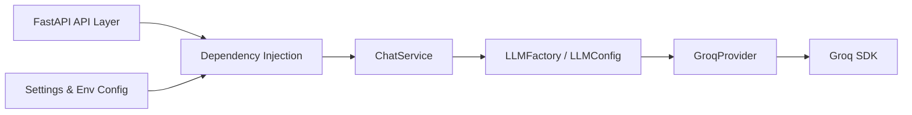

# AI Project Template Backend

## Overview

This backend provides a reusable AI platform foundation built with FastAPI and Pydantic. It is designed to separate API routing, configuration, service orchestration, and LLM provider integration, while remaining easy to extend for additional AI providers.

## Architecture Diagram



## Folder Structure

- `app/` - Main backend package
  - `api/` - FastAPI routers and endpoints
  - `config/` - Environment and application settings
  - `core/` - Logging, lifespan management, middleware, exception handling
  - `db/` - Async SQLAlchemy engine, session factory, declarative base, and DB dependency
  - `dependencies/` - FastAPI dependency providers
  - `llm/` - LLM abstractions, models, provider plumbing, and response parsing
  - `models/` - SQLAlchemy ORM models (persistence layer)
  - `prompts/` - Prompt abstractions and prompt manager
  - `services/` - Business logic and orchestration
- `alembic/` - Alembic migration environment and versioned migration scripts
- `tests/` - Unit tests for core backend components
- `.env.example` - Example environment variables for local development
- `requirements.txt` - Python dependency list
- `pyproject.toml` - Project metadata and lint configuration

## Installation

1. Install Python 3.12 or later.
2. From the `backend/` directory, install dependencies:

```bash
python -m pip install -r requirements.txt
```

## Virtual Environment

Create and activate a virtual environment before installing dependencies.

Windows:

```bash
python -m venv .venv
.\.venv\Scripts\activate
```

macOS / Linux:

```bash
python -m venv .venv
source .venv/bin/activate
```

## Environment Variables

Copy `.env.example` to `.env` and update the values for your environment.

Required variables:

- `APP_NAME` - Application name used for metadata and logs.
- `APP_VERSION` - Application version returned by health checks.
- `ENVIRONMENT` - Runtime environment (`development`, `staging`, `production`).
- `DEBUG` - Enable debug mode for local development.
- `LLM_PROVIDER` - Selected provider name (currently `groq`).
- `GROQ_API_KEY` - Groq API key used for authentication.
- `GROQ_MODEL` - Groq model identifier.
- `DATABASE_URL` - Async PostgreSQL connection string (`postgresql+asyncpg://...`).
- `DB_ECHO` - Echo SQL statements to logs (development only).
- `DB_POOL_SIZE` / `DB_MAX_OVERFLOW` - Database connection pool sizing.
- `SECRET_KEY` - Secret used to sign JWTs (minimum 32 characters).
- `JWT_ALGORITHM` - JWT signing algorithm (e.g. `HS256`).
- `ACCESS_TOKEN_EXPIRE_MINUTES` - Access token lifetime in minutes.
- `REFRESH_TOKEN_EXPIRE_DAYS` - Refresh token lifetime in days.

Do not commit real secrets or API keys to source control.

## Running the Backend

Start the backend using Uvicorn from the `backend/` directory:

```bash
uvicorn app.main:app --reload --host 0.0.0.0 --port 8000
```

The application will be available at `http://127.0.0.1:8000`.

## Swagger Documentation

FastAPI automatically exposes interactive API documentation:

- `http://127.0.0.1:8000/docs` for Swagger UI
- `http://127.0.0.1:8000/redoc` for ReDoc

## Database

Start a local PostgreSQL instance with Docker Compose:

```bash
docker compose up -d postgres
```

Apply the latest schema migrations from the `backend/` directory:

```bash
alembic upgrade head
```

Generate a new migration after changing models in `app/models/`:

```bash
alembic revision --autogenerate -m "describe the change"
```

## Ruff Commands

Check code style and perform linting with Ruff:

```bash
python -m ruff check .
```

## Running Tests

Run the backend unit test suite with pytest:

```bash
cd backend
pytest
```

## LLM Architecture

The backend uses a provider-agnostic LLM architecture:

- `BaseLLMProvider` defines the provider interface.
- `LLMConfig` encapsulates provider configuration.
- `LLMFactory` instantiates the configured provider.
- `ChatService` orchestrates chat requests and delegates to the provider.
- `LLMResponse` includes response content and optional metadata such as provider, model, tokens, latency, and finish reason.
- `ResponseParser` sanitizes and formats raw model output.

This separation keeps provider integration independent from API routing and business logic.

## Supported Providers

Currently supported provider:

- `Groq` via `app.llm.providers.groq.GroqProvider`

The platform is built to add new providers without changing endpoint or service code.

## Future Roadmap

Potential next steps include:

- Add support for OpenAI, Gemini, Ollama, and other LLM providers
- Add authentication and user management
- Add database persistence and repositories
- Add vector search / RAG support
- Add metrics, tracing, and observability integrations
- Add Docker and cloud deployment manifests

## Troubleshooting

- Confirm your active Python interpreter is Python 3.12 or later.
- Ensure `.env` exists and is populated from `.env.example`.
- Verify `GROQ_API_KEY` and `GROQ_MODEL` are set if using the Groq provider.
- If import errors occur, confirm you are running commands from the `backend/` directory.
- Use `python -m ruff check .` and `pytest` to verify environment and code health.

## Contributing

Contributions are welcome. When contributing:

- open an issue first for larger changes
- create a feature branch for new work
- keep changes focused and backward compatible
- run `python -m ruff check .` and `pytest` before submitting a pull request
- avoid committing real API keys or secrets
