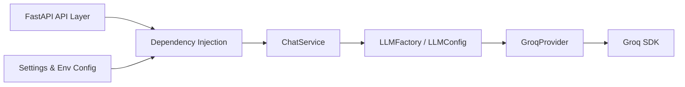
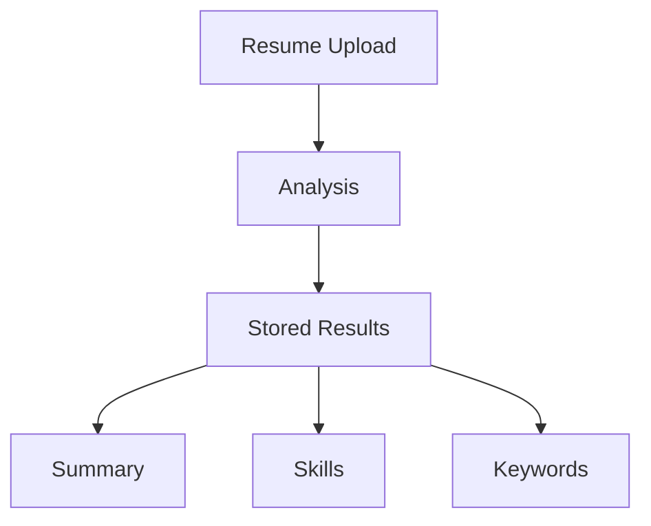
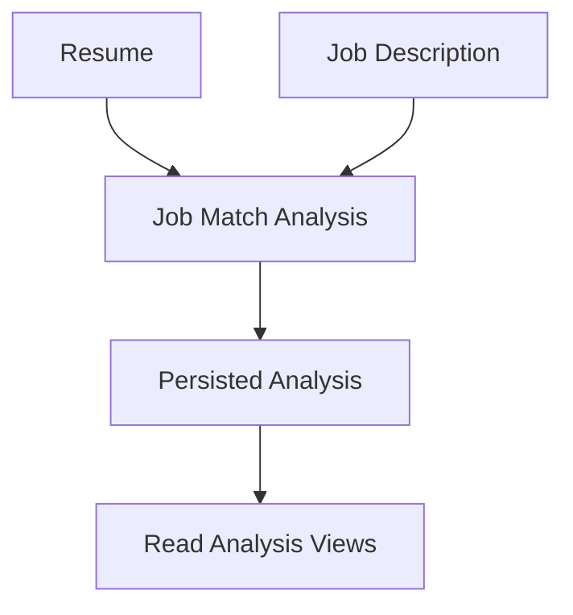

# AI Project Template Backend

## Overview

This backend provides a reusable AI platform foundation built with FastAPI and Pydantic. It is designed to separate API routing, configuration, service orchestration, and LLM provider integration, while remaining easy to extend for additional AI providers.

## Architecture Diagram



## Folder Structure

- `app/` - Main backend package
  - `api/` - FastAPI routers and endpoints
  - `config/` - Environment and application settings
  - `core/` - Logging, lifespan management, middleware, exception handling
  - `db/` - Async SQLAlchemy engine, session factory, declarative base, and DB dependency
  - `dependencies/` - FastAPI dependency providers
  - `llm/` - LLM abstractions, models, provider plumbing, and response parsing
  - `models/` - SQLAlchemy ORM models (persistence layer)
  - `prompts/` - Prompt abstractions and prompt manager
  - `services/` - Business logic and orchestration
- `alembic/` - Alembic migration environment and versioned migration scripts
- `tests/` - Unit tests for core backend components
- `.env.example` - Example environment variables for local development
- `requirements.txt` - Python dependency list
- `pyproject.toml` - Project metadata and lint configuration

## Installation

1. Install Python 3.12 or later.
2. From the `backend/` directory, install dependencies:

```bash
python -m pip install -r requirements.txt
```

## Virtual Environment

Create and activate a virtual environment before installing dependencies.

Windows:

```bash
python -m venv .venv
.\.venv\Scripts\activate
```

macOS / Linux:

```bash
python -m venv .venv
source .venv/bin/activate
```

## Environment Variables

Copy `.env.example` to `.env` and update the values for your environment.

Required variables:

- `APP_NAME` - Application name used for metadata and logs.
- `APP_VERSION` - Application version returned by health checks.
- `ENVIRONMENT` - Runtime environment (`development`, `staging`, `production`).
- `DEBUG` - Enable debug mode for local development.
- `LLM_PROVIDER` - Selected provider name (currently `groq`).
- `GROQ_API_KEY` - Groq API key used for authentication.
- `GROQ_MODEL` - Groq model identifier.
- `DATABASE_URL` - Async PostgreSQL connection string (`postgresql+asyncpg://...`).
- `DB_ECHO` - Echo SQL statements to logs (development only).
- `DB_POOL_SIZE` / `DB_MAX_OVERFLOW` - Database connection pool sizing.
- `SECRET_KEY` - Secret used to sign JWTs (minimum 32 characters).
- `JWT_ALGORITHM` - JWT signing algorithm (e.g. `HS256`).
- `ACCESS_TOKEN_EXPIRE_MINUTES` - Access token lifetime in minutes.
- `REFRESH_TOKEN_EXPIRE_DAYS` - Refresh token lifetime in days.
- `RESUME_UPLOAD_DIR` - Directory where uploaded resume files are stored.
- `RESUME_MAX_UPLOAD_SIZE_MB` - Maximum allowed resume upload size, in megabytes.
- `RESUME_ALLOWED_EXTENSIONS` - Comma-separated list of allowed resume file extensions.
- `RESUME_ALLOWED_MIME_TYPES` - Comma-separated list of allowed resume MIME types.

Do not commit real secrets or API keys to source control.

## Running the Backend

Start the backend using Uvicorn from the `backend/` directory:

```bash
uvicorn app.main:app --reload --host 0.0.0.0 --port 8000
```

The application will be available at `http://127.0.0.1:8000`.

## Swagger Documentation

FastAPI automatically exposes interactive API documentation:

- `http://127.0.0.1:8000/docs` for Swagger UI
- `http://127.0.0.1:8000/redoc` for ReDoc

The Swagger UI includes an **Authorize** button for Bearer JWT authentication.

## Authentication API

Authentication endpoints:

- `POST /auth/register` - Register a user and return access/refresh tokens.
- `POST /auth/login` - Authenticate with email/password and return tokens.
- `POST /auth/refresh` - Exchange a refresh token for a new token pair.
- `GET /users/me` - Return the current authenticated user.

### JWT Authentication

- Token type is Bearer.
- Access tokens include subject, role, token type, issued-at, and expiration claims.
- Refresh tokens include subject, token type, issued-at, and expiration claims.

Use the Authorization header:

```http
Authorization: Bearer <access_token>
```

### Local Authentication Workflow

1. Call `POST /auth/register` with email, password, and full name.
2. Copy the returned `access_token`.
3. Click **Authorize** in Swagger and paste `Bearer <access_token>`.
4. Call `GET /users/me` to verify authenticated access.
5. When access token expires, call `POST /auth/refresh` with `refresh_token`.

## Resume API

Resume management endpoints require Bearer authentication and only operate on
the authenticated user's own records.

- `POST /resumes/upload` - Upload a new resume using `multipart/form-data`.
- `GET /resumes` - List the current user's resumes.
- `GET /resumes/{resume_id}` - Fetch a single resume owned by the current user.
- `GET /resumes/{resume_id}/download` - Download the stored resume file.
- `DELETE /resumes/{resume_id}` - Delete a resume and its stored file versions.

### Upload Requirements

- Supported formats: `pdf`, `doc`, `docx`
- Allowed MIME types: `application/pdf`, `application/msword`,
  `application/vnd.openxmlformats-officedocument.wordprocessingml.document`
- Maximum upload size: `RESUME_MAX_UPLOAD_SIZE_MB` megabytes (default: `5`)

Uploads use a multipart request with a `title` field and a `file` field. For
example:

```http
POST /resumes/upload
Authorization: Bearer <access_token>
Content-Type: multipart/form-data
```

The download endpoint returns the stored file as a `FileResponse` without
exposing any server filesystem paths.

## Resume Intelligence API

The analysis API is built on the existing analysis service and only exposes
thin REST endpoints. Every endpoint requires Bearer authentication and only
returns data for the authenticated user's own resumes.

### Workflow



### Endpoints

- `POST /analysis/{resume_id}` - Run a new analysis for a resume.
- `GET /analysis/{resume_id}` - Return the latest completed analysis.
- `GET /analysis/{resume_id}/summary` - Return ATS score, overall score,
  strengths, weaknesses, and recommendations.
- `GET /analysis/{resume_id}/skills` - Return extracted skills.
- `GET /analysis/{resume_id}/keywords` - Return extracted keywords.
- `GET /analysis/{resume_id}/history` - Return previous analyses newest first.
- `DELETE /analysis/{analysis_id}` - Delete one analysis record.

### Example Calls

```http
POST /analysis/550e8400-e29b-41d4-a716-446655440000
Authorization: Bearer <access_token>
```

```http
GET /analysis/550e8400-e29b-41d4-a716-446655440000/summary
Authorization: Bearer <access_token>
```

```http
GET /analysis/550e8400-e29b-41d4-a716-446655440000/skills
Authorization: Bearer <access_token>
```

```http
GET /analysis/550e8400-e29b-41d4-a716-446655440000/keywords
Authorization: Bearer <access_token>
```

```http
DELETE /analysis/550e8400-e29b-41d4-a716-446655440001
Authorization: Bearer <access_token>
```

## Job Intelligence API

The Job Intelligence API compares one resume against one job description and
stores a structured analysis. Routes are thin wrappers over service methods,
and every endpoint requires Bearer authentication.

### Workflow



### Endpoints

- `POST /job-analysis/{resume_id}/{job_id}` - Run analysis and persist results.
- `GET /job-analysis/{analysis_id}` - Return full analysis payload.
- `GET /job-analysis/{analysis_id}/summary` - Return score and insight fields.
- `GET /job-analysis/{analysis_id}/matched-skills` - Return matched skills.
- `GET /job-analysis/{analysis_id}/missing-skills` - Return missing skills.
- `GET /job-analysis/{analysis_id}/keywords` - Return matched keywords.
- `GET /job-analysis/history` - Return the current user's analysis history.
- `DELETE /job-analysis/{analysis_id}` - Delete one owned analysis.

### Example Calls

```http
POST /job-analysis/550e8400-e29b-41d4-a716-446655440000/660e8400-e29b-41d4-a716-446655440000
Authorization: Bearer <access_token>
```

```http
GET /job-analysis/770e8400-e29b-41d4-a716-446655440000
Authorization: Bearer <access_token>
```

```http
GET /job-analysis/770e8400-e29b-41d4-a716-446655440000/summary
Authorization: Bearer <access_token>
```

```http
GET /job-analysis/history
Authorization: Bearer <access_token>
```

```http
DELETE /job-analysis/770e8400-e29b-41d4-a716-446655440000
Authorization: Bearer <access_token>
```

## Docker Deployment

The project includes a production-ready Docker setup with three services:
backend (FastAPI), PostgreSQL, and Redis.

### Prerequisites

- Docker Engine 24+
- Docker Compose v2+

### Required Environment Variables

Create a `.env` file in the project root (or export the variables) with at
least the following required values:

```bash
# Required — must be set before starting the stack
GROQ_API_KEY=gsk_your_groq_api_key_here
SECRET_KEY=your_256_bit_secret_here  # Generate: python -c "import secrets; print(secrets.token_urlsafe(48))"
```

Optional variables have safe development defaults defined in
`docker-compose.yml`.

### Building the Backend Image

```bash
docker compose build
```

This uses the multi-stage `backend/Dockerfile`:
- **Stage 1 (builder)**: Installs Python dependencies into a temporary directory.
- **Stage 2 (runtime)**: Copies only the compiled dependencies and application
  code into a minimal `python:3.12-slim` image. Runs as a non-root user.

### Starting the Complete Stack

```bash
docker compose up -d
```

This starts all three services in dependency order:
1. PostgreSQL (waits for healthy status)
2. Redis (waits for healthy status)
3. Backend (starts after both dependencies are healthy)

### Running Database Migrations

After the stack is running, apply the latest schema migrations:

```bash
docker compose exec backend alembic upgrade head
```

Generate a new migration after changing models:

```bash
docker compose exec backend alembic revision --autogenerate -m "describe the change"
```

### Migration Strategy for Production

Migrations are **not** automatically executed on application startup to avoid
race conditions when multiple backend replicas start simultaneously. Instead:

1. Run migrations as a one-off step during deployment (before routing traffic
   to new replicas).
2. Use a dedicated migration job/container in orchestrated environments
   (Kubernetes Job, Nomad batch job, etc.).
3. For zero-downtime deployments, run `alembic upgrade head` while the old
   replicas are still serving traffic, then roll out the new replicas.

### Viewing Logs

```bash
# All services
docker compose logs -f

# Specific service
docker compose logs -f backend
docker compose logs -f postgres
docker compose logs -f redis
```

### Checking Container Health

```bash
# List all containers and their health status
docker compose ps

# Query the application health endpoints
curl http://localhost:8000/health
curl http://localhost:8000/live
curl http://localhost:8000/ready
```

### Stopping the Stack

```bash
# Stop without removing volumes
docker compose down

# Stop and remove all volumes (deletes database data)
docker compose down -v
```

### PostgreSQL Configuration

| Variable | Default | Description |
|---|---|---|
| `POSTGRES_USER` | `postgres` | Database superuser name |
| `POSTGRES_PASSWORD` | `postgres` | Database superuser password |
| `POSTGRES_DB` | `resume_intelligence` | Database name |
| `POSTGRES_PORT` | `5432` | Host-mapped port |

### Redis Configuration

| Variable | Default | Description |
|---|---|---|
| `REDIS_PORT` | `6379` | Host-mapped port |

Redis data is persisted to a named Docker volume (`redis_data`). The
application gracefully falls back to in-memory caching if Redis is
unavailable.

### Backend Configuration

| Variable | Default | Required | Description |
|---|---|---|---|
| `GROQ_API_KEY` | — | Yes | Groq API key |
| `SECRET_KEY` | — | Yes | JWT signing secret (min 32 chars) |
| `ENVIRONMENT` | `production` | No | Runtime environment |
| `DEBUG` | `false` | No | Debug mode (set to `true` only in dev) |
| `UVICORN_WORKERS` | `4` | No | Number of Uvicorn worker processes |
| `BACKEND_PORT` | `8000` | No | Host-mapped port |

All other settings from `.env.example` are available as environment variables
with safe defaults.

### Production Secret Requirements

- `SECRET_KEY`: Minimum 32 characters. Generate with:
  ```bash
  python -c "import secrets; print(secrets.token_urlsafe(48))"
  ```
- `GROQ_API_KEY`: Valid Groq API key with access to the configured model.
- Never commit secrets to version control.
- Use Docker secrets, Kubernetes Secrets, or a vault solution in production.

## Database (Local Development)

Start a local PostgreSQL instance with Docker Compose:

```bash
docker compose up -d postgres
```

Apply the latest schema migrations from the `backend/` directory:

```bash
alembic upgrade head
```

Generate a new migration after changing models in `app/models/`:

```bash
alembic revision --autogenerate -m "describe the change"
```

## Ruff Commands

Check code style and perform linting with Ruff:

```bash
python -m ruff check .
```

## Running Tests

Run the backend unit test suite with pytest:

```bash
cd backend
pytest
```

## LLM Architecture

The backend uses a provider-agnostic LLM architecture:

- `BaseLLMProvider` defines the provider interface.
- `LLMConfig` encapsulates provider configuration.
- `LLMFactory` instantiates the configured provider.
- `ChatService` orchestrates chat requests and delegates to the provider.
- `LLMResponse` includes response content and optional metadata such as provider, model, tokens, latency, and finish reason.
- `ResponseParser` sanitizes and formats raw model output.

This separation keeps provider integration independent from API routing and business logic.

## Supported Providers

Currently supported provider:

- `Groq` via `app.llm.providers.groq.GroqProvider`

The platform is built to add new providers without changing endpoint or service code.

## Future Roadmap

Potential next steps include:

- Add support for OpenAI, Gemini, Ollama, and other LLM providers
- Add database persistence and repositories
- Add vector search / RAG support
- Add metrics, tracing, and observability integrations
- Add Docker and cloud deployment manifests

## CI/CD

The project includes a GitHub Actions workflow (`.github/workflows/ci.yml`) that
runs on every push and pull request to the `main` branch. The workflow validates:

- Python 3.12 setup with pip caching
- Dependency installation
- Ruff linting
- Full pytest suite
- Alembic migration state (`alembic check`)
- Docker image build

## Prometheus Metrics

A `/metrics` endpoint exposes Prometheus-compatible application metrics:

| Metric | Type | Labels |
|---|---|---|
| `http_requests_total` | Counter | `method`, `endpoint`, `status` |
| `http_request_duration_seconds` | Histogram | `method`, `endpoint` |
| `http_active_requests` | Gauge | — |
| `ai_requests_total` | Counter | `provider` |
| `ai_request_duration_seconds` | Histogram | `provider` |
| `db_queries_total` | Counter | `operation` |
| `db_query_duration_seconds` | Histogram | `operation` |
| `cache_hits_total` | Counter | `namespace` |
| `cache_misses_total` | Counter | `namespace` |
| `rate_limit_violations_total` | Counter | `bucket` |

No user-identifying labels (user IDs, emails, tokens) are exposed.

```bash
curl http://localhost:8000/metrics
```

## Sentry Error Monitoring

Sentry integration is optional and disabled by default. To enable it, set the
following environment variables:

```bash
SENTRY_DSN=https://your-dsn@sentry.io/project-id
SENTRY_TRACES_SAMPLE_RATE=0.1
SENTRY_SEND_DEFAULT_PII=false
SENTRY_ENVIRONMENT=production
```

When `SENTRY_DSN` is empty (the default), the application runs normally without
Sentry. No DSN is required for local development.

## Troubleshooting

- Confirm your active Python interpreter is Python 3.12 or later.
- Ensure `.env` exists and is populated from `.env.example`.
- Verify `GROQ_API_KEY` and `GROQ_MODEL` are set if using the Groq provider.
- If import errors occur, confirm you are running commands from the `backend/` directory.
- Use `python -m ruff check .` and `pytest` to verify environment and code health.

## Contributing

Contributions are welcome. When contributing:

- open an issue first for larger changes
- create a feature branch for new work
- keep changes focused and backward compatible
- run `python -m ruff check .` and `pytest` before submitting a pull request
- avoid committing real API keys or secrets
